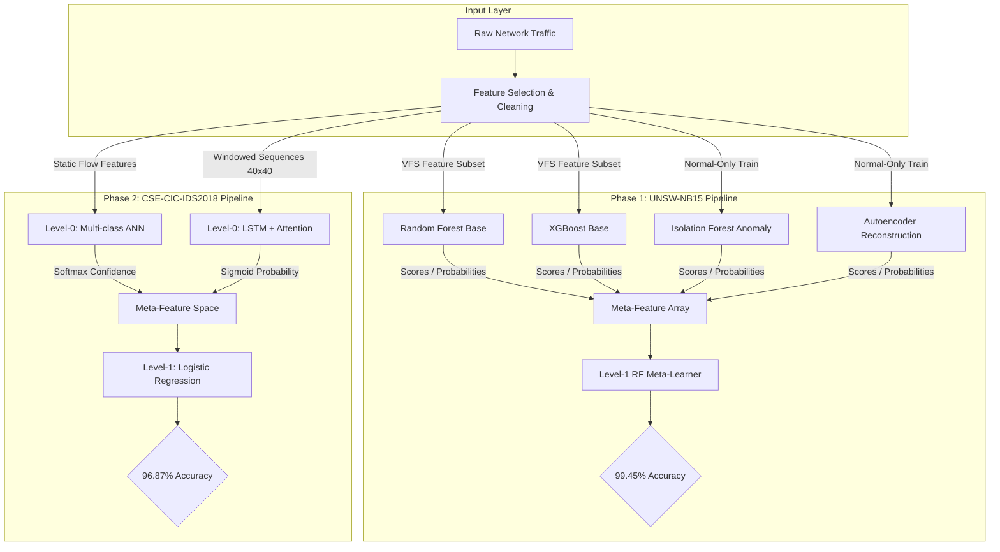
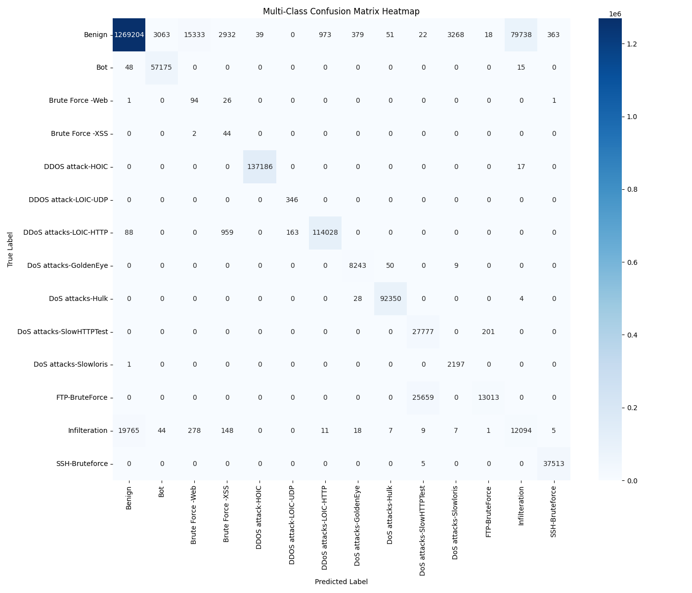
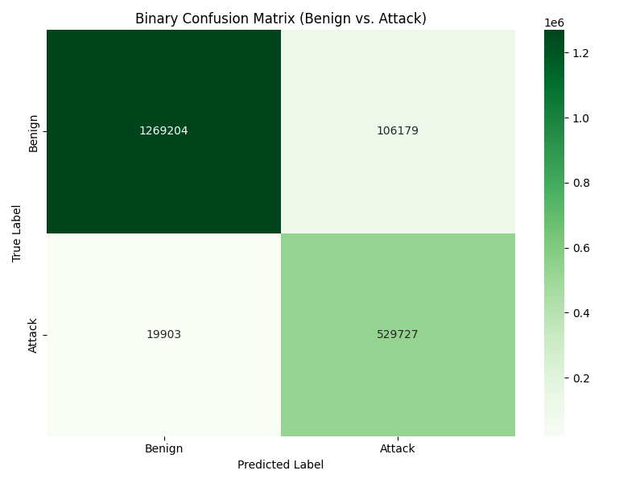
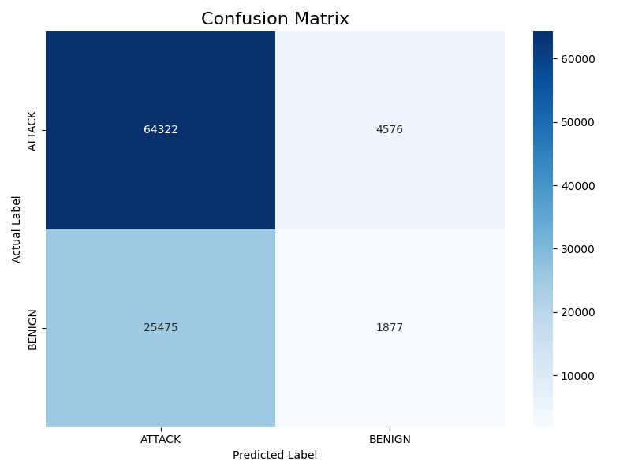
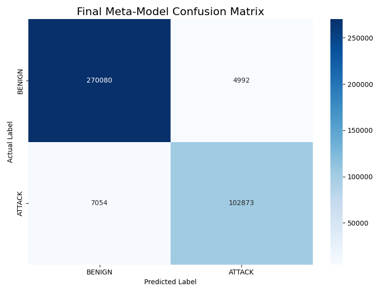

# Enhanced Network Intrusion Detection Using Machine Learning Techniques

B.Tech Final Year Project — Department of Computer Science & Engineering  
**B.P. Poddar Institute of Management & Technology** (Affiliated to MAKAUT), Kolkata, India  
**Academic Year**: 2024 – 2025

---

## 👥 Authors & Project Team

* **Students**:
  * **Sourish Bose** 
  * **Swastik Kumar Tripathi** 
  * **Yubaraj Biswas** 
  * **Sakshi Singh** 
* **Supervisor**: **Mrs. Soumi Tokdar**, Assistant Professor, Dept. of CSE

---

## 📌 Project Abstract

Modern network security threats are increasingly sophisticated, dynamic, and distributed, rendering traditional signature-based detection systems ineffective. Machine learning offers a promising alternative, yet single-model architectures often struggle to balance high detection rates across diverse attack vectors (e.g., DoS/DDoS, Brute Force, Web Attacks, Botnets) while minimizing false-alarm rates.

This project designs and implements an **Enhanced hybrid Network Intrusion Detection System (NIDS)** that progresses in two key phases:

### Phase 1: Hybrid Supervised-Unsupervised Meta-Classifier (UNSW-NB15)
To establish a robust baseline, we combined supervised classifiers (**Random Forest**, **XGBoost**) for known threat signatures with unsupervised models (**Autoencoder**, **Isolation Forest**) for zero-day anomaly detection. These predictions were concatenated into a meta-dataset and fed into a **Random Forest Meta-Classifier**, achieving an outstanding **99.45% accuracy** and **98.75% F1-score**.

### Phase 2: Deep Learning & Temporal Stacking (CSE-CIC-IDS2018)
Transitioning to the more complex CSE-CIC-IDS2018 dataset, we engineered two specialized "expert" base models:
1. **Multi-class Artificial Neural Network (ANN)**: Optimized for high-throughput, pattern-based classification of static flow features (**92.01% accuracy**).
2. **Binary Time-Series LSTM + Multi-Head Attention**: Engineered to extract long-term sequential dependencies and capture chronological attack footprints over sliding windows of 40 network flows (**68.78% accuracy**, but a critical **93.3% ATTACK recall**).

To resolve the trade-off between the ANN's computational efficiency and the LSTM's sequential awareness, a **Logistic Regression Meta-Classifier (Level-1)** was trained on the prediction scores of both base models. The resulting stacked ensemble effectively filters out the LSTM's false alarms while retaining its high sensitivity, achieving a final test accuracy of **96.87%**.

---

## 🏗️ Architecture Overview



---

## 📂 Repository Structure

The repository is structured to separate code, results, and pre-trained configurations cleanly:

```directory
├── /data/                  # Ignored local data sandbox (Raw CSV extracts)
├── /models/                # Pre-trained models, encoders, and scalers (Git-ignored)
│   ├── README.md           # Instructions on downloading Kaggle weights
│   ├── ann_multiclass_model/
│   ├── final_tuned_model/
│   └── meta_model_artifacts/
├── /notebooks/             # Interactive Jupyter Notebooks
│   ├── cse-cic-ids2018-nids-ann.ipynb
│   ├── time-series-lstm-multi-head-attention.ipynb
│   └── meta-model-ann-ltsm-w-multi-head-attention.ipynb
├── /reports/               # Tracked academic reports & visualizations
│   ├── /figures/           # Confusion matrices and training histories
│   └── /metrics/           # Detailed classification report JSONs
├── .gitignore              # Standard exclusions (caches, .venv, model binaries)
├── requirements.txt        # PIP dependencies list
└── README.md               # Main project overview
```

* **[notebooks/](notebooks/)**: Jupyter notebooks documenting the training pipelines.
* **[models/](models/)**: Placeholder directories for pre-trained weights.
* **[reports/](reports/)**: Visual heatmaps and JSON files containing raw performance evaluation parameters.

---

## 📊 Project Notebooks & External Artifacts

Due to file size restrictions, model weights (`.h5`/`.keras`), scalers (`.pkl`), and predictions (`.npy`) must be downloaded from our Kaggle repository and placed in the appropriate subdirectory inside `models/`.

| # | Notebook / Component | File Link | Description & Key Features | Kaggle Link (Weights/Artifacts) |
|---|---|---|---|---|
| **1** | **Multi-class ANN Classifier (CIC-IDS2018)** | [cse-cic-ids2018-nids-ann.ipynb](notebooks/cse-cic-ids2018-nids-ann.ipynb) | Feedforward network trained on engineered static features. Resolves high-frequency traffic attacks with low computational overhead. | [View on Kaggle](https://www.kaggle.com/code/ybtheflashbppimt/cse-cic-ids2018-nids-ann) |
| **2** | **Time-Series LSTM + Multi-Head Attention** | [time-series-lstm-multi-head-attention.ipynb](notebooks/time-series-lstm-multi-head-attention.ipynb) | LSTM network combined with multi-head self-attention mechanism to capture temporal and sequential context of slow network intrusions. | [View on Kaggle](https://www.kaggle.com/code/ybtheflashbppimt/time-series-lstm-multi-head-attention) |
| **3** | **Final Level-1 Meta-Model (Logistic Regression)** | [meta-model-ann-ltsm-w-multi-head-attention.ipynb](notebooks/meta-model-ann-ltsm-w-multi-head-attention.ipynb) | Stacking model utilizing predictions from Level-0 networks to produce the final consensus. Evaluates the fusion accuracy. | [View on Kaggle](https://www.kaggle.com/code/ybtheflashbppimt/meta-model-ann-ltsm-w-multi-head-attention) |

---

## 📈 Results & Visualizations

The performance curves and confusion matrices obtained during the validation and testing phases are saved in `/reports/figures/`.

### Phase 2: CSE-CIC-IDS2018 Base Models vs. Stacked Meta-Model

#### Multi-Class ANN Performance
* **Accuracy**: **92.01%**
* Highly effective at identifying high-volume, static signature attacks, but suffers on minority categories due to class imbalance.

<table>
  <tr>
    <td align="center"><b>ANN Multiclass Confusion Matrix</b></td>
    <td align="center"><b>ANN Binary Confusion Matrix</b></td>
  </tr>
  <tr>
    <td></td>
    <td></td>
  </tr>
</table>

#### Time-Series LSTM + Attention Performance
* **Accuracy**: **68.78%**
* **Attack Recall**: **93.3%**
* Functions as a sensitive "paranoid guard", successfully flagging sequential threats over time, but generates a higher false-alarm rate (lower precision).

<p align="center">
  
  <br><i>LSTM + Multi-Head Attention Binary Confusion Matrix</i>
</p>

#### Final Stacked Meta-Learner (Logistic Regression)
* **Accuracy**: **96.87%**
* **Attack Precision**: **95.4%** | **Attack Recall**: **93.6%**
* Effectively "fixes" the base learner weaknesses. By combining predictions, the Level-1 meta-model inherits the high recall of the LSTM while utilizing the ANN's static confidence score to filter out false alarms.

<p align="center">
  
  <br><i>Stacked Meta-Learner Confusion Matrix</i>
</p>

---

## 🚀 Getting Started

### 1. Clone the Repository
```bash
git clone https://github.com/your-username/Enhanced-NIDS-MetaLearning.git
cd Enhanced-NIDS-MetaLearning
```

### 2. Environment Setup
Create a virtual environment and install the dependencies:
```bash
python -m venv .venv
source .venv/bin/activate  # On Windows: .venv\Scripts\activate
pip install -r requirements.txt
```

### 3. Fetch Pre-trained Weights
Download the pre-trained weights and predictions from the Kaggle links in the table and place them in `/models/` according to [models/README.md](models/README.md).

---

## 🎓 Acknowledgments

This project was developed collaboratively in the **Cyber Range Lab** of the Australian Centre for Cyber Security (ACCS) and the University of New South Wales, Sydney (for UNSW-NB15 resources) and the Canadian Institute for Cybersecurity (for CICIDS2018 benchmark dataset access). Model training and hyperparameter tuning were executed in a shared Kaggle environment hosted by Sakshi Singh/Swastik Kumar Tripathi to leverage pooled GPU resources (2x NVIDIA Tesla T4 GPUs).
